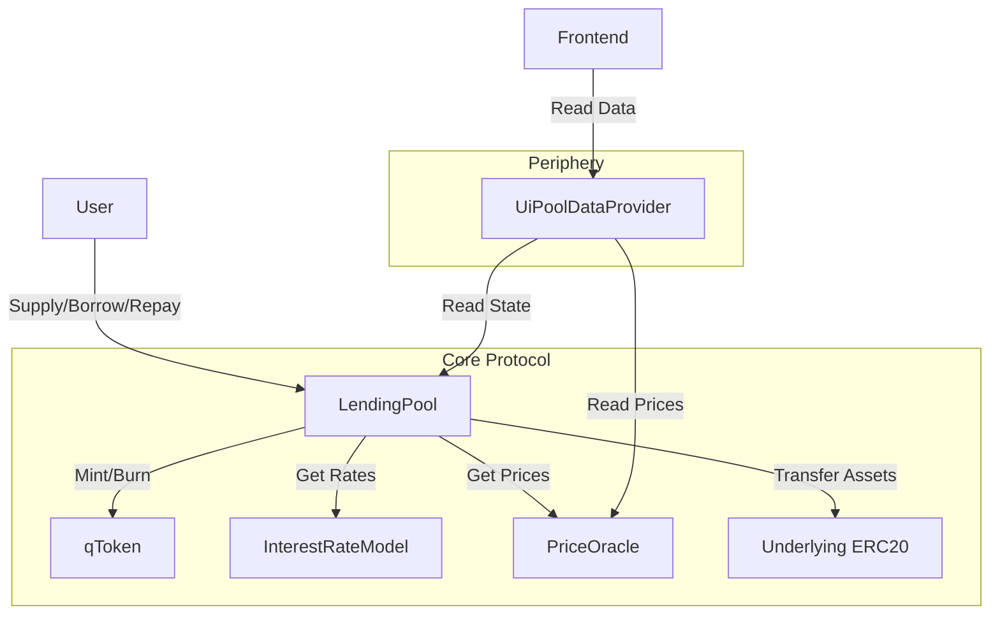

<p align="center">
  <h1 align="center">QuickLend Protocol</h1>
  <p align="center">
    <strong>A Decentralized, Non-Custodial Lending Protocol</strong>
  </p>
  <p align="center">
    <a href="#features">Features</a> •
    <a href="#architecture">Architecture</a> •
    <a href="#quick-start">Quick Start</a> •
    <a href="#tech-stack">Tech Stack</a> •
    <a href="#documentation">Documentation</a>
  </p>
</p>

---

## Overview

**QuickLend** is a decentralized, non-custodial liquidity protocol where users can participate as **Suppliers** (providing liquidity to earn interest) or **Borrowers** (taking over-collateralized loans). The protocol uses pooled liquidity, algorithmic interest rates based on utilization, and a robust health factor system for position management.

### Core Philosophy

- **Pooled Liquidity** — No peer-to-peer matching; users interact with a smart contract pool
- **Over-Collateralization** — All loans must be backed by more value than the debt to ensure solvency
- **Algorithmic Interest** — Rates are determined by the ratio of borrowed funds to supplied funds

---

## Features

- **Supply & Withdraw** — Deposit ERC-20 tokens and receive yield-bearing qTokens
- **Borrow & Repay** — Take over-collateralized loans against your supplied assets
- **Multi-Asset Support** — Supply Asset A and borrow Asset B with cross-collateral support
- **Liquidations** — Third-party liquidators can liquidate unhealthy positions for a bonus
- **Real-time Health Factor** — Monitor position health with USD-denominated calculations
- **Gas Optimized** — Built with Solady's FixedPointMathLib for efficient on-chain math

---

## Architecture

```
quicklend/
├── smart-contract/     # Foundry-based Solidity smart contracts
│   ├── src/
│   │   ├── core/       # LendingPool, InterestRateModel
│   │   ├── tokens/     # qToken (yield-bearing ERC20)
│   │   ├── interfaces/ # Contract interfaces
│   │   ├── periphery/  # UiPoolDataProvider
│   │   └── mocks/      # Test mocks
│   └── test/           # Foundry tests
├── frontend/           # Next.js 16 frontend application
│   └── src/
│       ├── app/        # Next.js App Router pages
│       ├── components/ # React components
│       ├── hooks/      # Wagmi & custom hooks
│       ├── lib/        # Utilities & contract configs
│       ├── providers/  # RainbowKit & QueryClient providers
│       └── store/      # Zustand state management
├── backend/            # Fastify-based indexer & API server
│   └── src/
│       ├── api/        # REST API routes
│       ├── config/     # Environment configuration
│       ├── db/         # Drizzle ORM schemas & migrations
│       └── lib/        # Utilities & blockchain clients
└── docs/               # Design docs & specifications
```

### Smart Contract Architecture



### Core Contracts

| Contract | Description |
|----------|-------------|
| **LendingPool.sol** | Main entry point for Supply, Borrow, Repay, Withdraw, Liquidate |
| **qToken.sol** | Yield-bearing ERC20 representing pool share |
| **InterestRateModel.sol** | Stateless contract for rate calculations (WAD arithmetic) |
| **UiPoolDataProvider.sol** | Read-only aggregator for frontend data |

---

## Quick Start

### Prerequisites

- **Docker** and **Docker Compose**

### Run with Docker

```bash
make up          # Build and start all services
```

This starts the full stack:

| Service      | Port  | Description                                       |
|------------- |------ |-------------------------------------------------- |
| **anvil**    | 8545  | Local EVM chain                                   |
| **deployer** | —     | Deploys contracts, seeds liquidity & test positions |
| **postgres** | 5432  | PostgreSQL 16 database                            |
| **redis**    | 6379  | Redis 7 cache                                     |
| **backend**  | 3001  | Fastify API + blockchain event indexer            |
| **frontend** | 3000  | Next.js web application                           |

Open [http://localhost:3000](http://localhost:3000) and connect with the test wallet below.

### Test Wallet

The Docker sandbox pre-seeds positions for the default Anvil account:

| | |
|---|---|
| **Mnemonic** | `test test test test test test test test test test test junk` |
| **Account** | `0xf39Fd6e51aad88F6F4ce6aB8827279cffFb92266` |
| **Private Key** | `0xac0974bec39a17e36ba4a6b4d238ff944bacb478cbed5efcae784d7bf4f2ff80` |

Import this mnemonic into MetaMask, add the Anvil network (`http://localhost:8545`, Chain ID `31337`), and you will see:

- **Supplied**: 10 WETH (~$25,000), 0.5 WBTC (~$22,500)
- **Borrowed**: 5,000 USDC
- **Wallet balances**: 1M USDC, 90 WETH, 9.5 WBTC

Three other Anvil accounts (#1-#3) act as liquidity providers, each supplying large amounts of USDC, WETH, and WBTC respectively, so there is enough pool liquidity for borrowing and testing liquidations.

### Docker Commands

```bash
make up       # Build and start all services
make down     # Stop all services and remove volumes
make logs     # Follow logs from all services
make e2e      # Run E2E tests in Docker
make deploy   # Re-deploy contracts only
make clean    # Stop services, remove volumes and images
```

> Environment variables (contract addresses, database URLs) are injected automatically in Docker — no manual `.env` configuration needed.

For manual setup and local development, see **[DEV.md](DEV.md)**.

---

## Tech Stack

| Category | Technology |
|----------|------------|
| **Smart Contracts** | Solidity 0.8.20, Foundry, OpenZeppelin, Solady |
| **Frontend** | Next.js 16, React 19, TypeScript, Tailwind CSS, Framer Motion |
| **Web3 Integration** | Wagmi, Viem, RainbowKit, TanStack Query |
| **Backend** | Node.js, Fastify, TypeScript, Drizzle ORM |
| **Database** | PostgreSQL, Redis |
| **Testing** | Foundry (contracts), Vitest + RTL (frontend unit), Playwright (E2E) |
| **Deployment** | Docker Compose (full stack) |

---

## Risk Parameters

| Parameter | Value | Description |
|-----------|-------|-------------|
| Base Rate | 2% | Minimum borrow rate at 0% utilization |
| Slope | 10% | Rate increase per unit utilization |
| Reserve Factor | 10% | Protocol fee on interest earnings |
| Close Factor | 50% | Maximum debt repayable per liquidation |
| Max Liquidation Bonus | 20% | Maximum bonus for liquidators |

---

## Security

- **Reentrancy Protection** — OpenZeppelin's `ReentrancyGuard` on all state-changing functions
- **Pausable** — Emergency pause mechanism for protocol owner
- **Health Factor Validation** — Dual threshold system (LTV for new borrows, Liquidation Threshold for positions)
- **Oracle Price Validation** — All prices validated to be non-zero
- **Safe Token Transfers** — OpenZeppelin's `SafeERC20` for all token operations

---

## Documentation

- **[Development Guide](docs/DEV.md)** — Manual setup, environment variables, testing
- **[Product Requirements](docs/PRODUCT_REQUIREMENT_DOC.md)** — Functional requirements and core mechanics
- **[Technical Specification](docs/TECH_SPEC.md)** — Smart contract architecture and data structures
- **[Design Philosophy](docs/DESIGN_PHILOSOPHY.md)** — UI/UX design principles
- **[Smart Contract Integration](docs/SMART_CONTRACT_INTEGRATION.md)** — Frontend integration guide
- **[Security Audit](smart-contract/SECURITY_AUDIT.md)** — Security audit findings

---

## License

MIT