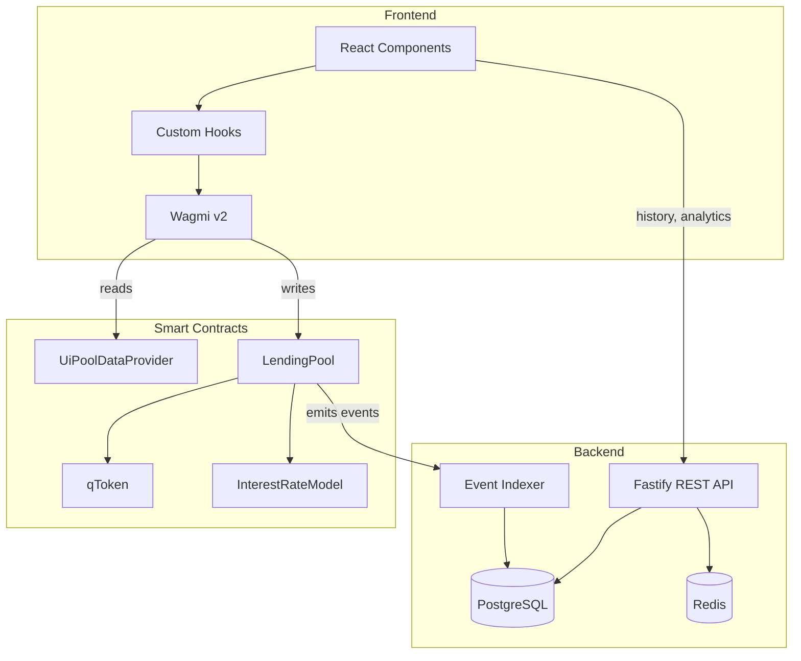

# Smart Contract Integration Guide

This document describes how the QuickLend frontend and backend integrate with the on-chain smart contracts. All code snippets reflect the actual implementation.

## Table of Contents

1. [Overview](#overview)
2. [Contract Addresses](#contract-addresses)
3. [Frontend Integration](#frontend-integration)
4. [Backend Integration](#backend-integration)
5. [Data Flow](#data-flow)
6. [Error Handling](#error-handling)
7. [Testing](#testing)

---

## Overview

QuickLend's smart contract architecture consists of:

| Contract | Purpose |
|----------|---------|
| **LendingPool** | Main entry point for all user interactions (supply, borrow, withdraw, repay, liquidate) |
| **qToken** | Yield-bearing ERC20 tokens representing user deposits |
| **InterestRateModel** | Calculates borrow/supply rates based on utilization |
| **UiPoolDataProvider** | Read-only helper for batched data fetching |
| **MockPriceOracle** | Provides asset price feeds (pluggable for Chainlink in production) |



---

## Contract Addresses

### Docker Sandbox (Anvil)

When using `make up`, the deploy script (`scripts/deploy-and-extract.sh`) automatically extracts addresses and writes them to env files:

- `/artifacts/frontend.env` — loaded by the frontend container
- `/artifacts/backend.env` — loaded by the backend container

### Manual Development

After deploying contracts locally, addresses are in `smart-contract/broadcast/Deploy.s.sol/31337/run-latest.json`. Copy them to env files:

```bash
# frontend/.env.local
NEXT_PUBLIC_LENDING_POOL_ADDRESS=0x...
NEXT_PUBLIC_UI_DATA_PROVIDER_ADDRESS=0x...
NEXT_PUBLIC_PRICE_ORACLE_ADDRESS=0x...
NEXT_PUBLIC_USDC_ADDRESS=0x...
NEXT_PUBLIC_WETH_ADDRESS=0x...
NEXT_PUBLIC_WBTC_ADDRESS=0x...
NEXT_PUBLIC_WALLETCONNECT_PROJECT_ID=your_project_id
NEXT_PUBLIC_API_URL=http://localhost:3001

# backend/.env
LENDING_POOL_ADDRESS=0x...
UI_DATA_PROVIDER_ADDRESS=0x...
USDC_ADDRESS=0x...
WETH_ADDRESS=0x...
WBTC_ADDRESS=0x...
```

---

## Frontend Integration

### Web3 Stack

| Library | Version | Purpose |
|---------|---------|---------|
| Wagmi | v2 | React hooks for contract reads/writes |
| Viem | v2 | TypeScript Ethereum client |
| RainbowKit | v2 | Wallet connection modal |
| TanStack Query | v5 | Data fetching and caching |

### Wagmi Configuration

The wagmi config uses RainbowKit's `getDefaultConfig` helper (`lib/wagmi.ts`):

```typescript
import { getDefaultConfig } from '@rainbow-me/rainbowkit';
import { mainnet, sepolia, anvil } from 'wagmi/chains';

const localAnvil = {
  ...anvil,
  id: 31337,
  name: 'Anvil',
  rpcUrls: {
    default: { http: ['http://127.0.0.1:8545'] },
  },
};

export const wagmiConfig = getDefaultConfig({
  appName: 'QuickLend',
  projectId: process.env.NEXT_PUBLIC_WALLETCONNECT_PROJECT_ID || '...',
  chains: [localAnvil, sepolia, mainnet],
  ssr: true,
});
```

### Contract ABIs & Addresses

Defined inline in `lib/contracts.ts` (no ABI file imports). Exports:

- `LENDING_POOL_ABI` — View + write functions (supply, borrow, repay, withdraw, liquidate, getUserHealthFactor, etc.)
- `UI_POOL_DATA_PROVIDER_ABI` — `getMarketData(pool)` and `getUserData(pool, user)`
- `ERC20_ABI` — approve, allowance, balanceOf, decimals, symbol
- `contracts` — Object with `lendingPool` and `uiDataProvider` address/abi pairs
- `getContractAddresses()` — Validated address helper

### Hook Architecture

All hooks are in `frontend/src/hooks/` and use the `'use client'` directive.

#### `useMarkets` — Fetch All Market Data

Reads from `UiPoolDataProvider.getMarketData()` on-chain. Transforms raw `bigint` values to UI-friendly `number` format.

```typescript
// Returns: { markets: MarketData[], isLoading, error, refetch, isConfigured }
export function useMarkets() {
  const { data, isLoading, error, refetch } = useReadContract({
    address: contracts.uiDataProvider.address,
    abi: contracts.uiDataProvider.abi,
    functionName: 'getMarketData',
    args: contracts.lendingPool.address ? [contracts.lendingPool.address] : undefined,
    query: {
      enabled: !!contracts.uiDataProvider.address && !!contracts.lendingPool.address,
      refetchInterval: 15000,
      staleTime: 10000,
    },
  });
  // Transforms bigint fields to numbers using formatUnits
}
```

**MarketData shape:**
```typescript
interface MarketData {
  asset: `0x${string}`;
  symbol: string;
  decimals: number;
  ltv: number;                  // e.g. 0.8
  liquidationThreshold: number; // e.g. 0.85
  supplyAPY: number;
  borrowAPY: number;
  totalSupplied: number;        // human-readable (e.g. 500000 for USDC)
  totalBorrowed: number;
  availableLiquidity: number;
  price: number;                // USD price
}
```

#### `useUserPositions` — Fetch User Positions

Reads from `UiPoolDataProvider.getUserData()`. Depends on `useMarkets` for decimal lookup.

```typescript
// Returns: { positions, userPositions, isLoading, error, refetch, isConnected, address }
export function useUserPositions() {
  const { address, isConnected } = useAccount();
  const { markets } = useMarkets();
  // Reads getUserData, filters out zero-balance positions
}
```

**UserPosition shape:**
```typescript
interface UserPosition {
  asset: `0x${string}`;
  symbol: string;
  suppliedAmount: number;  // human-readable
  borrowedAmount: number;
  isCollateral: boolean;
}
```

#### `useProtocolHealth` — User Health Factor

Reads `LendingPool.getUserHealthFactor()` directly on-chain. Refetches every 5 seconds for critical data.

```typescript
// Returns: { healthFactor: number, status: 'safe'|'warning'|'danger'|'none', isLoading, error }
export function useProtocolHealth() {
  // healthFactor >= 1.5 → 'safe'
  // healthFactor >= 1.2 → 'warning'
  // healthFactor > 0    → 'danger'
}
```

#### `useLendingActions` — Write Operations

Uses `useWriteContract` + `useWaitForTransactionReceipt` for all LendingPool interactions.

```typescript
// Returns: { supply, withdraw, borrow, repay, setCollateral, liquidate,
//            txHash, isPending, isConfirming, isSuccess, error, reset, isConnected }
export function useLendingActions() {
  const supply = async (asset: `0x${string}`, amount: string, decimals: number = 18) => {
    writeContract({
      address: contracts.lendingPool.address,
      abi: contracts.lendingPool.abi,
      functionName: 'supply',
      args: [asset, parseUnits(amount, decimals)],
    });
  };
  // Similar pattern for withdraw, borrow, repay, setCollateral, liquidate
}
```

#### `useTokenApproval` — ERC20 Approval Flow

Manages the approve-before-supply/repay flow. Reads current allowance, balance, and decimals. Provides `approveMax()` and `approveAmount()`.

```typescript
// Returns: { allowance, balance, decimals, needsApproval, approveMax, approveAmount,
//            isApproving, isConfirmingApproval, isApproved, ... }
export function useTokenApproval(tokenAddress: `0x${string}` | undefined) {
  // Reads allowance(user, lendingPool) and balanceOf(user)
  // approveMax() approves maxUint256
  // needsApproval(amount) checks if allowance < parsedAmount
}
```

#### `useWallet` — Wallet Connection

Wraps Wagmi's `useAccount`/`useDisconnect` and RainbowKit's `useConnectModal`/`useAccountModal`.

```typescript
// Returns: { address, isConnected, isConnecting, openConnectModal, openAccountModal,
//            disconnect, displayAddress }
export function useWallet() {
  // displayAddress: "0xf39F...2266" (truncated)
}
```

#### `useWalletBalance` — Token Balance

Simple hook to read an ERC20 `balanceOf` for the connected wallet.

```typescript
// Returns: { balance: number, isLoading, refetch }
export function useWalletBalance(tokenAddress: `0x${string}` | undefined, decimals: number = 18)
```

#### `useTransactionHistory` — Paginated History from Backend

Uses TanStack Query to fetch from the backend API (not on-chain).

```typescript
// Returns: { history: TransactionEvent[], pagination, isLoading, error, refetch }
export function useTransactionHistory(page: number = 1, limit: number = 20) {
  const { address } = useAccount();
  const { data } = useQuery({
    queryKey: ['transaction-history', address, page, limit],
    queryFn: () => fetchHistory(address!, page, limit),
    enabled: !!address,
    refetchInterval: 30_000,
  });
}
```

### Client-Side Calculations

`lib/calculations.ts` provides `calculateHealthFactor()` which computes:

- **Health Factor**: `(Σ collateral * price * liquidationThreshold) / Σ debt`
- **Net APY**: `(supplyIncome - borrowCost) / equity`
- **Borrow Power Used**: `totalDebt / maxBorrow`
- **Liquidation Price**: Price at which the main collateral triggers HF < 1.0

### API Client

`lib/api.ts` provides functions to call the backend:

```typescript
const API_BASE = process.env.NEXT_PUBLIC_API_URL ?? 'http://localhost:3001';

export async function fetchHistory(address: string, page?: number, limit?: number): Promise<PaginatedResponse<TransactionEvent>>
export async function fetchAnalytics(): Promise<{ success: boolean; data: AnalyticsTVL }>
```

---

## Backend Integration

### Architecture

The backend is a Fastify 5 server with an embedded event indexer. It provides REST API endpoints for historical data and analytics, while the frontend reads real-time data directly from contracts.

| Component | Technology | Purpose |
|-----------|------------|---------|
| **Runtime** | Node.js 20 | Server runtime |
| **Framework** | Fastify 5 | HTTP server with Swagger docs at `/docs` |
| **Database** | PostgreSQL 16 | Event storage, user positions, market snapshots |
| **Cache** | Redis 7 | Market API response caching (30s TTL) |
| **ORM** | Drizzle ORM | Type-safe SQL queries |
| **Web3** | Viem | Ethereum client for reading on-chain data |
| **Validation** | @sinclair/typebox | JSON schema validation on routes |

### Event Indexer

The indexer (`src/indexer/`) runs as part of the Fastify server process:

1. **Startup**: Loads last processed block from `indexerState` table
2. **Backfill**: Fetches historical events from the chain in batches
3. **Watch**: Subscribes to new LendingPool events in real-time
4. **Materialize**: Updates `userPositions` and `liquidationLogs` tables from raw events
5. **Snapshot**: Takes market data snapshots every 60 seconds via `UiPoolDataProvider`

**Indexed Events**: Supply, Withdraw, Borrow, Repay, Liquidate, ReserveUsedAsCollateralEnabled, ReserveUsedAsCollateralDisabled

### Database Schema

| Table | Purpose |
|-------|---------|
| `events` | Raw indexed blockchain events (txHash, blockNumber, eventName, asset, userAddress, amount) |
| `userPositions` | Materialized supply/borrow positions per user per asset |
| `marketSnapshots` | Periodic snapshots of on-chain market data (totalSupplied, totalBorrowed, rates, prices) |
| `liquidationLogs` | Detailed liquidation event records |
| `notificationPreferences` | User notification settings (reserved for future use) |
| `indexerState` | Tracks last indexed block for resumability |

### API Routes

All routes are prefixed with `/api/v1/`. Swagger docs available at `/docs`.

#### Markets

| Method | Endpoint | Description | Cache |
|--------|----------|-------------|-------|
| GET | `/api/v1/markets` | All markets with current rates and utilization | Redis 30s |
| GET | `/api/v1/markets/:asset` | Single market by asset address | Redis 30s |

Markets are read directly from `UiPoolDataProvider.getMarketData()` on-chain, cached in Redis.

#### Users

| Method | Endpoint | Description |
|--------|----------|-------------|
| GET | `/api/v1/users/:address/positions` | User positions from indexed data |
| GET | `/api/v1/users/:address/health` | Health factor from indexed data |
| GET | `/api/v1/users/:address/history` | Paginated transaction history (`?page=1&limit=20`) |

#### Analytics

| Method | Endpoint | Description |
|--------|----------|-------------|
| GET | `/api/v1/analytics/tvl` | Current TVL by asset |
| GET | `/api/v1/analytics/tvl/history` | Historical TVL (`?days=30`) |
| GET | `/api/v1/analytics/liquidations` | Recent liquidations (`?days=7`) |

#### Health

| Method | Endpoint | Description |
|--------|----------|-------------|
| GET | `/health` | Service health check |

### Example API Response

**GET `/api/v1/markets`**:
```json
{
  "success": true,
  "data": [
    {
      "asset": "0x5FbDB2315678afecb367f032d93F642f64180aa3",
      "symbol": "USDC",
      "decimals": 6,
      "ltv": "0.8",
      "liqThreshold": "0.85",
      "supplyAPY": "0.02",
      "borrowAPY": "0.085",
      "totalSupplied": "500000",
      "totalBorrowed": "5000",
      "availableLiquidity": "495000",
      "priceUsd": "1"
    }
  ],
  "timestamp": "2026-02-15T06:45:00.000Z"
}
```

**GET `/api/v1/users/:address/history?page=1&limit=20`**:
```json
{
  "success": true,
  "data": [
    {
      "txHash": "0xabc...",
      "blockNumber": "42",
      "eventName": "Supply",
      "asset": "0x...",
      "amount": "10000000000000000000",
      "timestamp": "2026-02-15T06:40:00.000Z"
    }
  ],
  "pagination": { "page": 1, "limit": 20 }
}
```

---

## Data Flow

### Real-Time Data (Frontend ↔ Contracts)

Frontend hooks read directly from smart contracts via Wagmi:

```
useMarkets        → UiPoolDataProvider.getMarketData(pool)     [15s refetch]
useUserPositions  → UiPoolDataProvider.getUserData(pool, user)  [15s refetch]
useProtocolHealth → LendingPool.getUserHealthFactor(user)       [5s refetch]
useWalletBalance  → ERC20.balanceOf(user)                       [15s refetch]
useTokenApproval  → ERC20.allowance(user, lendingPool)          [on demand]
```

### Write Operations (Frontend → Contracts)

All write operations go through `useLendingActions`:

```
1. User enters amount in UI
2. useTokenApproval.needsApproval() checks if approval needed
3. If needed: useTokenApproval.approveMax() → ERC20.approve(lendingPool, maxUint256)
4. useLendingActions.supply() → LendingPool.supply(asset, amount)
5. useWaitForTransactionReceipt tracks confirmation
6. On success: hooks auto-refetch via refetchInterval
```

### Historical Data (Frontend → Backend → Database)

```
1. LendingPool emits events (Supply, Borrow, Repay, Withdraw, Liquidate)
2. Backend EventIndexer watches for events in real-time
3. Indexer stores raw events in PostgreSQL `events` table
4. Indexer materializes `userPositions` and `liquidationLogs`
5. Indexer snapshots market data every 60s into `marketSnapshots`
6. Frontend calls fetchHistory() → GET /api/v1/users/:address/history
7. Frontend calls fetchAnalytics() → GET /api/v1/analytics/tvl
```

---

## Error Handling

### Frontend

- **Contract not configured**: Hooks check for address existence before calling (`enabled: !!address`)
- **Transaction errors**: `useLendingActions` and `useTokenApproval` expose `error` state
- **Network issues**: Wagmi handles reconnection; TanStack Query retries failed requests
- **Stale data**: All hooks use `refetchInterval` and `staleTime` for freshness

### Backend

- **Indexer recovery**: Resumes from last processed block stored in `indexerState`
- **API errors**: Global error handler returns structured `{ success, error, code }` responses
- **Cache miss**: Falls through to on-chain reads; result cached for next request
- **Rate limiting**: 100 requests/minute per IP via `@fastify/rate-limit`

---

## Testing

### Frontend Unit Tests (Vitest)

Located in `frontend/src/__tests__/`, `frontend/src/hooks/__tests__/`, and `frontend/src/lib/__tests__/`.

```bash
cd frontend
npx vitest run              # Run all tests
npx vitest --coverage       # With coverage report
```

### Frontend E2E Tests (Playwright)

Located in `frontend/e2e/`. Tests navigation, dashboard rendering, market tables, and history pages.

```bash
# Local
cd frontend && npx playwright test

# Docker (against full stack)
make e2e
```

### Smart Contract Tests (Foundry)

```bash
cd smart-contract
forge test                          # All tests
forge test --match-test testSupply  # Single test
forge test -vvv                     # Verbose traces
forge coverage                      # Coverage report
```
