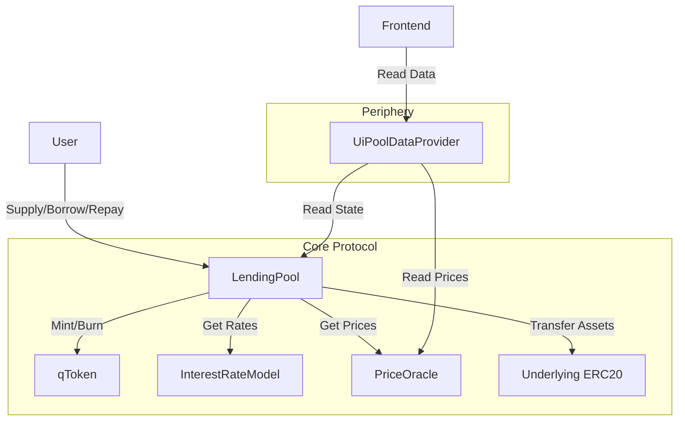
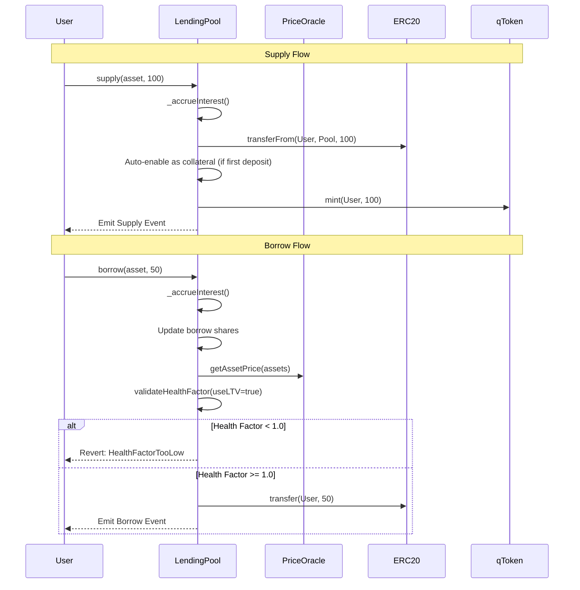
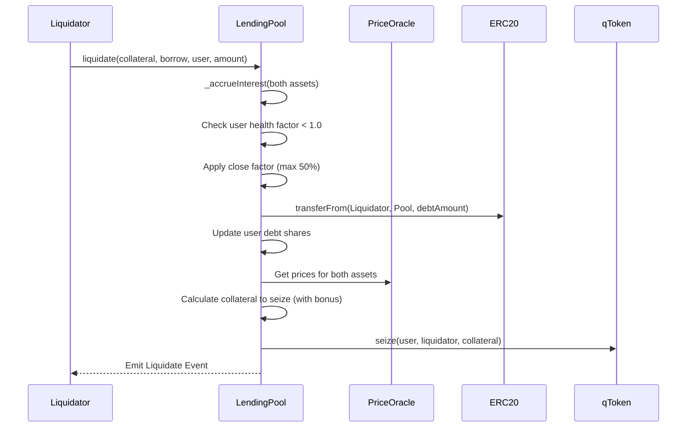

# QuickLend Smart Contracts

The core smart contracts for the QuickLend decentralized lending protocol. Built using [Foundry](https://book.getfoundry.sh/).

## Architecture

### Core Contracts

*   **`LendingPool.sol`**: The main entry point for user interactions (Supply, Borrow, Repay, Withdraw, Liquidate). Includes reentrancy protection, pausability, and health factor validation.
*   **`qToken.sol`**: Yield-bearing ERC20 tokens minted to suppliers representing their share in the pool (e.g., qUSDC). Controlled exclusively by the LendingPool.
*   **`InterestRateModel.sol`**: Stateless contract that calculates borrow and supply rates based on pool utilization using WAD (18 decimal) arithmetic.

### Periphery Contracts

*   **`UiPoolDataProvider.sol`**: Read-only helper contract for the frontend to fetch aggregated market and user position data in a single call.

### Interfaces

*   **`ILendingPool.sol`**: Full interface for LendingPool interactions.
*   **`IqToken.sol`**: Interface for qToken operations.
*   **`IInterestRateModel.sol`**: Interface for interest rate calculations.
*   **`IUiPoolDataProvider.sol`**: Interface for UI data provider with aggregated data structs.
*   **`IPriceOracle.sol`**: Interface for price oracle integration.

## Key Features

### Interest Rate Model

The protocol uses a linear interest rate model with the following parameters:

| Parameter | Value | Description |
|-----------|-------|-------------|
| Base Rate | 2% | Minimum borrow rate at 0% utilization |
| Slope | 10% | Rate of increase per unit utilization |
| Reserve Factor | 10% | Protocol fee on interest earnings |

### Risk Parameters

| Parameter | Value | Description |
|-----------|-------|-------------|
| Close Factor | 50% | Maximum debt repayable per liquidation |
| Max Liquidation Bonus | 20% | Maximum bonus for liquidators |

### Security Features

*   **Reentrancy Protection**: All state-changing functions use OpenZeppelin's `ReentrancyGuard`
*   **Pausable**: Owner can pause/unpause the protocol in emergencies
*   **Health Factor Validation**: Dual threshold system using LTV for new borrows and Liquidation Threshold for existing positions
*   **Oracle Price Validation**: All oracle prices are validated to be non-zero
*   **Safe Token Transfers**: Uses OpenZeppelin's `SafeERC20` for all token operations
*   **Decimal Normalization**: Proper handling of tokens with different decimals

## Contract Interaction Flow

### High-Level Architecture



### Supply & Borrow Flow



### Liquidation Flow



## API Reference

### User Functions

| Function | Description |
|----------|-------------|
| `supply(asset, amount)` | Supply assets and receive qTokens. Auto-enables as collateral on first deposit. |
| `withdraw(asset, amount)` | Burn qTokens and receive underlying. Validates health factor. |
| `borrow(asset, amount)` | Borrow against collateral. Uses LTV for health check. |
| `repay(asset, amount)` | Repay borrowed assets. Caps repayment to actual debt. |
| `liquidate(collateral, borrow, user, amount)` | Liquidate unhealthy positions. Subject to close factor. |
| `setUserUseReserveAsCollateral(asset, bool)` | Enable/disable asset as collateral. |

### View Functions

| Function | Description |
|----------|-------------|
| `getUserHealthFactor(user)` | Get user's health factor using liquidation threshold. |
| `getMarketList()` | Get all listed market addresses. |
| `markets(asset)` | Get full market data struct. |
| `userBorrowShares(asset, user)` | Get user's borrow shares for an asset. |
| `userCollateralEnabled(asset, user)` | Check if asset is enabled as collateral. |

### Admin Functions

| Function | Description |
|----------|-------------|
| `initMarket(...)` | Initialize a new lending market with risk parameters. |
| `setOracle(newOracle)` | Update the price oracle address. |
| `pause()` | Pause the protocol. |
| `unpause()` | Unpause the protocol. |

## Getting Started

### Prerequisites

*   **Foundry**: You must have Foundry installed.
    ```bash
    curl -L https://foundry.paradigm.xyz | bash
    foundryup
    ```

### Installation

1.  Clone the repository (if you haven't already):
    ```bash
    git clone https://github.com/your-username/quicklend.git
    cd quicklend/smart-contract
    ```

2.  **Install Dependencies**:
    This project uses git submodules for dependencies (OpenZeppelin, Solady, Forge Std). You must initialize them:
    ```bash
    git submodule update --init --recursive
    ```
    
    *Alternatively, if you are setting up from scratch or missing libraries:*
    ```bash
    forge install
    ```

## Usage

### Build

Compile the smart contracts:

```bash
forge build
```

### Test

Run the test suite:

```bash
forge test

forge test --gas-report
```

Run with verbosity for detailed output:

```bash
forge test -vvv
```

Run coverage report:

```bash
forge coverage
```

### Deploy

To deploy to a local testnet (Anvil):

1.  Start Anvil:
    ```bash
    anvil
    ```

2.  Deploy using the script:
    ```bash
    forge script script/Deploy.s.sol:DeployScript --rpc-url http://localhost:8545 --private-key <PRIVATE_KEY> --broadcast
    ```

## Project Structure

```
smart-contract/
├── src/
│   ├── core/                    # Core protocol logic
│   │   ├── LendingPool.sol      # Main lending pool contract
│   │   └── InterestRateModel.sol # Interest rate calculations
│   ├── tokens/
│   │   └── qToken.sol           # Yield-bearing token
│   ├── interfaces/              # Contract interfaces
│   │   ├── ILendingPool.sol
│   │   ├── IqToken.sol
│   │   ├── IInterestRateModel.sol
│   │   ├── IUiPoolDataProvider.sol
│   │   └── IPriceOracle.sol
│   ├── periphery/
│   │   └── UiPoolDataProvider.sol # Frontend data helper
│   └── mocks/                   # Test mock contracts
│       ├── MockERC20.sol
│       └── MockPriceOracle.sol
├── test/                        # Foundry tests
│   ├── LendingPool.t.sol
│   └── InterestRateModel.t.sol
├── script/                      # Deployment scripts
└── lib/                         # Dependencies (git submodules)
```

## Dependencies

*   [OpenZeppelin Contracts](https://github.com/OpenZeppelin/openzeppelin-contracts) - Security primitives and token standards
*   [Solady](https://github.com/Vectorized/solady) - Gas-optimized fixed-point math utilities
*   [Forge Std](https://github.com/foundry-rs/forge-std) - Foundry testing utilities

## License

MIT
