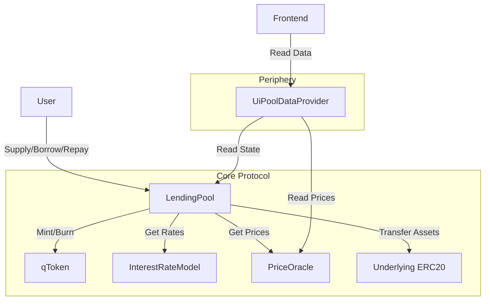
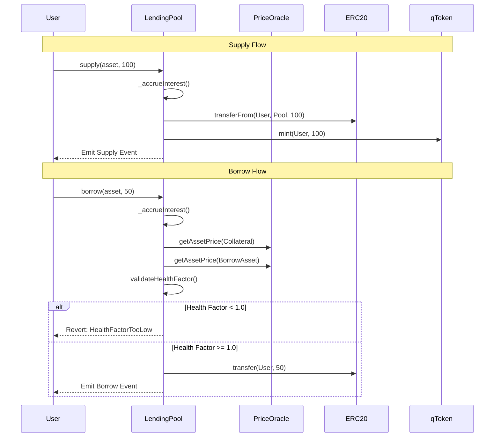

# QuickLend Smart Contracts

The core smart contracts for the QuickLend decentralized lending protocol. Built using [Foundry](https://book.getfoundry.sh/).

## Architecture

*   **`LendingPool.sol`**: The main entry point for user interactions (Supply, Borrow, Repay, Withdraw, Liquidate).
*   **`qToken.sol`**: Yield-bearing ERC20 tokens minted to suppliers (e.g., qUSDC).
*   **`InterestRateModel.sol`**: Calculates borrow and supply rates based on pool utilization.
*   **`UiPoolDataProvider.sol`**: Helper contract for the frontend to fetch aggregated market data.

## Contract Interaction Flow

### High-Level Architecture



### Supply & Borrow Flow



## Getting Started

### Prerequisites

*   **Foundry**: You must have Foundry installed.
    ```bash
    curl -L https://foundry.paradigm.xyz | bash
    foundryup
    ```

### Installation

1.  Clone the repository (if you haven't already):
    ```bash
    git clone https://github.com/your-username/quicklend.git
    cd quicklend/smart-contract
    ```

2.  **Install Dependencies**:
    This project uses git submodules for dependencies (OpenZeppelin, Solady, Forge Std). You must initialize them:
    ```bash
    git submodule update --init --recursive
    ```
    
    *Alternatively, if you are setting up from scratch or missing libraries:*
    ```bash
    forge install
    ```

## Usage

### Build

Compile the smart contracts:

```bash
forge build
```

### Test

Run the test suite (including new features like Collateral Toggling and UI Data Provider):

```bash
forge test
```

### Deploy

To deploy to a local testnet (Anvil):

1.  Start Anvil:
    ```bash
    anvil
    ```

2.  Deploy using the script:
    ```bash
    forge script script/Deploy.s.sol:DeployScript --rpc-url http://localhost:8545 --private-key <PRIVATE_KEY> --broadcast
    ```

## Project Structure

*   `src/core`: Core logic (LendingPool, InterestRateModel).
*   `src/tokens`: Token implementations (qToken).
*   `src/interfaces`: Interface definitions.
*   `src/periphery`: Frontend helpers (UiPoolDataProvider).
*   `test`: Foundry tests.
